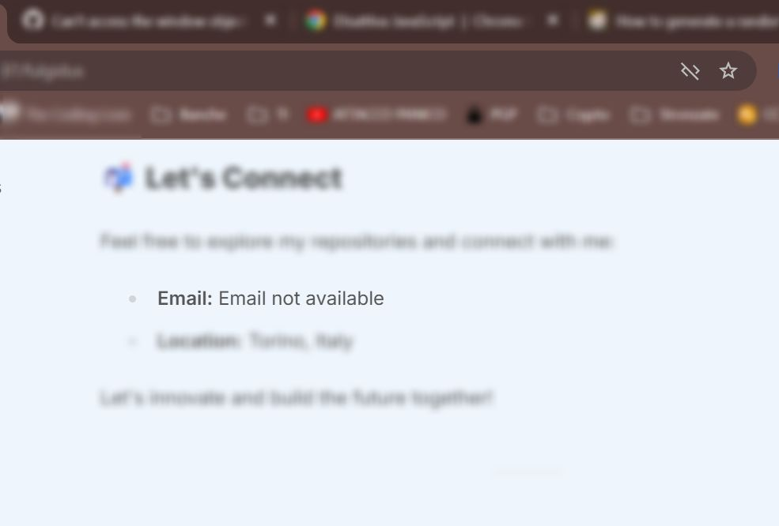
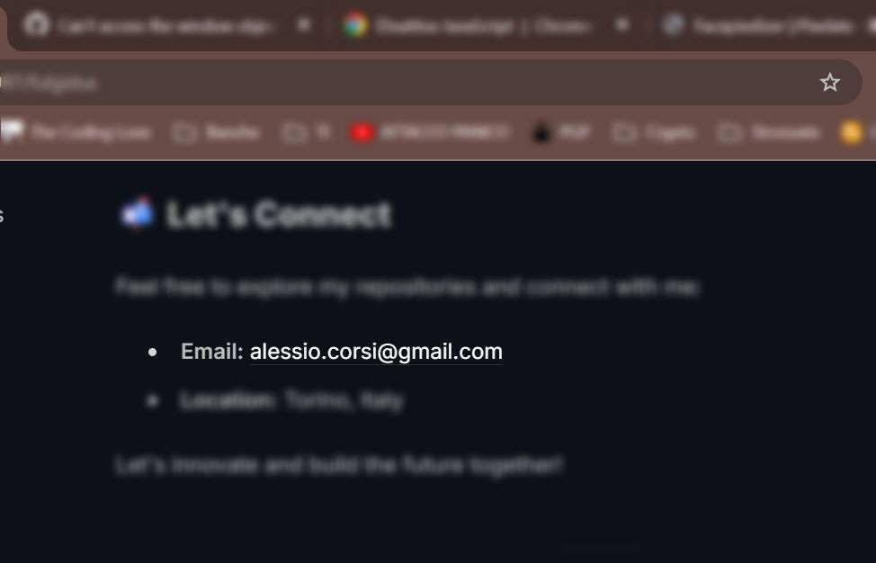

## Introduction

In today’s digital age, protecting sensitive information like email addresses is paramount. One common challenge developers face is safeguarding
email addresses on public-facing websites from being harvested by malicious bots and scrapers. In this technical article, I will walk you
through the creation of a Vue.js component called `EmailObfuscator.vue`, designed to thwart such scraping attempts while maintaining usability
for legitimate users.

## The Problem

When we embed email addresses directly into HTML, they become easy targets for web crawlers that scrape data for malicious purposes. These bots often use simple text extraction techniques to gather emails, which can then be used for spamming or other nefarious activities.

To mitigate this risk, developers need a method to obfuscate email addresses in a way that remains invisible to automated scripts but still accessible to human users. This is where `EmailObfuscator.vue` comes into play.

## The Solution

The primary goal of the `EmailObfuscator.vue` component is to encode email addresses into an unreadable format for bots, while providing a clear
and functional link to users visiting the site with JavaScript-enabled browsers.

### Component Overview

Below is the code snippet for `EmailObfuscator.vue`. This component takes an obfuscated version of the email address as a prop and decodes it
on-the-fly using Vue.js reactivity. It also includes a fallback slot for non-JavaScript environments, ensuring accessibility for all users.

```vue
<script setup>
import { onMounted, ref } from 'vue'
const props = defineProps({
  emailEntities: {
    type: String,
    required: true,
  },
})
const decodedEmail = ref('')
onMounted(() => {
  const decoder = document.createElement('textarea')
  decoder.innerHTML = props.emailEntities
  decodedEmail.value = decoder.textContent.trim()
})
</script>

<template>
  <a v-if="decodedEmail" :href="`mailto:${decodedEmail}`"> <!-- Won't be decoded if the client doesn't actually have a document -->
    <slot>
      {{ decodedEmail }} <!-- Fallback for Vue.js component -->
    </slot>
  </a>
</template>
```
### How It Works

1. **Prop Binding**: The component accepts an `emailEntities` prop, which contains the obfuscated email address.
2. **Reactivity and Lifecycle Hooks**:
   - We use Vue’s `ref` to create a reactive variable `decodedEmail`, initially set to `''` (empty string).
   - On the `onMounted` lifecycle hook, we create a new element in the DOM using  `document.createElement('textarea')`. This step assures us that the client does indeed have a fully functioning browser.
   - We "pass it trough" the textarea pushing it in via `.innerHTML` 
   - We then take it out via `.textContent` and save to `decodedEmail`

### Obfuscating Email Addresses

To effectively protect email addresses, we need to encode them into an unreadable format. One common method is to use URL encoding.

For example, the email address `"contact@example.com"` can be encoded as

```js
'&#x63;&#x6F;&#x6E;&#x74;&#x61;&#x63;&#x74;&#x40;&#x65;&#x78;&#x61;&#x6D;&#x70;&#x6C;&#x65;&#x2E;&#x63;&#x6F;&#x6D;'
```

This process ensures that bots fail to recognize the email address as a valid target.

### Integrating with Astro

In this project, we are using Astro.js, a modern web framework designed for speed and performance.
To ensure the correct usage of `EmailObfuscator.vue` we are goint to leverage the server side rendering (SSR) of our Astro site.
All the encoding will naturally happen either on the server or during the build phase of the webside, long before it can be transmitted to the client.
At that point, we need to ensure our Vue.js component only renders on the client-side, avoiding potential server-side rendering issues. We achieve this by using the `client:only="vue"` directive.

Below is an excerpt from the `index.astro` file where we encode an email and use the `EmailObfuscator.vue` component:
```astro
// index.astro

<!--Other imports -----> import EmailObfuscator from '@/components/EmailObfuscator.vue' // Convert email to HTML entities
const email = 'alessio.corsi@gmail.com' const emailEntities = Array.from(email) .map((char) => `&#${char.charCodeAt(0)};`)
.join(''

<!--[omissis...] ----->

<strong>Email:</strong>
<EmailObfuscator emailEntities={emailEntities} client:only="vue">
  <span slot="fallback">Email not available</span>
</EmailObfuscator>

<!--- [omissis...] --->

```

### Visual Comparison

To illustrate the effectiveness of `EmailObfuscator.vue`, we have included two images:

- **Without JavaScript**: Displays a fallback message to users who have disabled JavaScript in their browsers.
- **With JavaScript**: Renders a functional email link for users with JavaScript enabled.

## Conclusion

By implementing `EmailObfuscator.vue`, we have effectively protected our email addresses from being harvested by malicious bots, while maintaining usability for human users. This approach ensures that your site remains secure and accessible to a wide range of visitors.  
This solution showcases the power of Vue.js in building dynamic and secure web components, integrated seamlessly within an Astro.js framework.