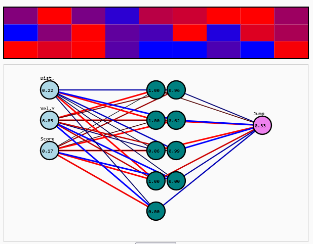

## Introduction

What began as a lightweight and somewhat playful programming experiment quickly transformed into an immersive and multi-faceted technical journey, deeply rooted in the domains of neuroevolution, real-time game physics, and browser-based simulation techniques. Initially, the objective was intentionally simple: replicate the well-known "Chrome Dino" offline game — the one that keeps you entertained when your internet drops — using a contemporary and high-performance web technology stack.

The intent was to use the project as a stepping stone to get more familiar with Rust and WebAssembly, and perhaps have a bit of fun along the way. However, as I dove deeper, the scope expanded considerably. Each layer of complexity introduced new learning opportunities, pushing the boundaries of what I initially thought I would tackle. This meant integrating physics simulations, timing-based decision logic, inter-language interoperability, and eventually neuro-inspired AI techniques.

The twist — and what ultimately drove the project's evolution — was this: I didn’t just want to control the dinosaur. I wanted to design a system where the dinosaur could figure out how to play on its own — to develop behavior not through explicit instructions but by learning from its environment. That simple shift turned a clone into a living, evolving system capable of adapting to changes in its surroundings.

Rust served as the backbone for the simulation logic, providing unmatched memory safety and performance. WebAssembly bridged the gap to the browser, allowing for native-speed execution. On the frontend, TypeScript and HTML5 Canvas offered a responsive visual interface where behavior could be observed in real time. The result was a fully interactive, real-time simulation where intelligent behavior could emerge organically from a combination of simple rules and selection pressure.

This is the story of how I went from a few lines of physics code to a fully-fledged evolutionary simulation running thousands of independent neural agents. Along the way, I had to address problems in system design, real-time rendering, debugging black-box learning systems, and scaling up to massive parallelism — all within a browser tab. This journey not only deepened my understanding of Rust, WebAssembly, and neural networks, but also led me to appreciate the elegance of evolutionary learning and the importance of clear visualization when working with complex adaptive systems.

## Phase 1: Building the Game Loop

The first milestone was establishing the basic game mechanics: a continuous side-scrolling runner where the player-controlled character — a green rectangle representing the dinosaur — would have to jump over obstacles.

Gravity was simulated with vertical acceleration, and rectangular obstacles moved from right to left. If the dinosaur collided with one, the world reset. This logic was implemented entirely in Rust, then compiled to WebAssembly using `wasm-pack`. This early setup allowed me to define a clear, deterministic environment with simple physics.

The frontend was built using TypeScript, and a game loop running at 60 FPS updated and rendered the world. I kept things minimal at this stage, focusing on building a stable simulation core and visual feedback loop. The game rendered directly onto an HTML5 Canvas, with each frame reflecting updated positions for the dino and the incoming obstacles. It provided a quick feedback cycle for testing the physical correctness of my engine.

At this point, user interaction was the only input. The dinosaur would jump only if prompted via a mouse event. It was a fun clone, but devoid of intelligence. The next logical step was giving the dino the ability to act without human intervention — to perceive, decide, and act.

## Phase 2: Implementing a Basic Neural Network

To make the dinosaur act autonomously, I created a minimal feedforward neural network from scratch in Rust.

The network structure was straightforward but powerful enough to enable simple decision-making:

- **Inputs (3)**:
  - Distance to the next obstacle
  - Relative speed of obstacles (derived from score)
  - Current score (normalized)
- **Output (1)**: a value between 0 and 1, representing a decision to jump

I used a sigmoid function for activation. Each dinosaur was assigned a unique set of weights and a bias. The decision-making was encoded as follows: if the output exceeded 0.6, and the dinosaur was on the ground and the obstacle was sufficiently close, it would jump. The logic looked like this:

```rust
if dino.on_ground && output > 0.6 {
    dino.velocity_y = MAX_JUMP_FORCE;
    dino.on_ground = false;
}
```

Most dinosaurs still failed — understandably so, as they had random weights and no training mechanism. But this setup gave them the capacity to make decisions based on environmental input, which was the foundation for learning.

## Phase 3: Evolution Through Mutation

To facilitate learning, I implemented an evolutionary algorithm inspired by genetic algorithms and natural selection:

- Retain the best-performing individual as a seed for the next generation
- Generate a new population by mutating this best brain using Gaussian noise

```rust
fn evolve(&mut self) {
    web_sys::console::log_1(&"🦀: 🌱 Evolving!".into());
    let best = self.brains[self.best_index].clone();
    self.fitness_history.push(best.fitness);
    let seed_base = (self.generation as u64) * 1000;
    let mut new_brains = vec![best.clone()];
    for i in 1..POPULATION_SIZE {
        new_brains.push(best.mutate(0.4, seed_base + (i as u64)));
    }
    self.brains = new_brains;

    //...

    self.generation += 1;
}
```

The simulation loop would restart automatically once all dinosaurs had died. Over time, certain networks began to exhibit survival strategies: improved timing, better anticipation, and longer survival.

This stage transformed the simulation into a self-improving learning system. Performance steadily improved over generations, and the neural ecosystem became increasingly diverse. The dinosaurs weren’t being programmed to succeed — they were discovering, through trial and error, what worked.

## Phase 4: Adding Visual Debugging Tools

Although the dino was now evolving, I couldn’t easily interpret the learning process or the decision-making logic. So I added visual tools to help debug and monitor the brains of the best performers.

```html
<body>
    <canvas id="main" width="600" height="120"></canvas>
    <canvas id="fitness" width="600" height="100" style="margin-top: 1rem;"></canvas>
    <canvas id="weightsCanvas" width="600" height="100" style="margin-top: 1rem;"></canvas>
    <canvas id="neuralNet" width="600" height="300" style="margin-top: 1rem;"></canvas>
    <!-- ... -->
</body>
```

These tools included:

- A **fitness history graph** to visualize long-term progress across generations, updated in real time
- A **color-coded weight heatmap**, allowing visual inspection of how individual synaptic weights evolved
- A **real-time neural network visualization**, where nodes (neurons) and connections were drawn in the browser. Each connection’s color and thickness represented its weight, and each neuron showed its activation value

This instrumentation allowed me to gain a deeper understanding of what the best-performing networks were doing. It also provided helpful insights for fine-tuning mutation rates and other hyperparameters.

## Phase 5: Deeper Architectures and Smarter Brains

To increase the representational power of the network, I added a hidden layer with 9 neurons, transforming the architecture into 3 → 9 → 1. This change introduced non-linearity into the system and enabled more complex decision boundaries.

I implemented all forward-pass computations manually in Rust: matrix multiplication, bias addition, and sigmoid activation. This allowed full control and visibility into how data flowed through the network, and kept performance within acceptable limits for large-scale simulation.

The network viewer was updated to reflect this architectural change. Now, activations propagated from input to hidden to output neurons, and changes in weights could be observed over time. This made it possible to see not just the behavior, but the underlying reasoning structure that led to that behavior.



As expected, the network began to show better adaptability. It could now learn more subtle distinctions, like when to delay a jump or how to respond to faster obstacles.

Unexpectedly, I noticed that most hidden neurons eventually atrophied — their activation values flattened to zero. In response, I reduced the hidden layer to 3 neurons and still achieved comparable learning results. This was a valuable lesson in model simplicity and parsimony.

## Phase 6: Scaling the Simulation

With performance optimizations in place, I scaled up the simulation to handle thousands of agents in parallel. Initially I used 16 agents, then increased to 256, and eventually 5000. Each agent had its own isolated simulation world. The released version is capped at 200 to allow lower-end clients to run the simulation without lag.

Initially, rendering thousands of dino agents simultaneously was computationally expensive, so only the best-performing agent was visualized in detail. Others existed purely in simulation. But later, I added full swarm visualization to observe all agents attempting to succeed in real time.

Thanks to Rust’s computational efficiency and WebAssembly’s execution model, I was able to run thousands of updates per second inside a web browser. This allowed faster convergence in evolutionary learning and improved the overall responsiveness of the system.

## Phase 7: Deployment and Open Access

I deployed the project using GitHub Actions, which compiled the Rust code, bundled the frontend assets, and published everything on GitHub Pages. The final result is a fully static site that requires no backend or server. Users can load it and start simulating directly in the browser.

This makes it perfect for education, experimentation, and sharing. The entire stack runs locally, making the simulation fully reproducible, and the source code is open for others to explore and modify.

## Lessons Learned

- Building neural networks from scratch deepens intuition about how learning systems work
- Real-time visualization is crucial for understanding and debugging adaptive behavior
- Evolutionary strategies can yield surprisingly robust solutions even in constrained environments
- Rust + WebAssembly is a powerful stack for high-performance simulations in the browser
- Simplicity in design can lead to emergent complexity given the right feedback loops

## Future Work

There are many exciting directions to explore:

- Add additional output neurons to support complex actions like variable jump force
- Introduce alternative activation functions (e.g., tanh, ReLU)
- Store and reload successful networks to allow continuous improvement across sessions
- Add user tools to inspect and compare different brains
- Create level progression or curriculum learning challenges

## Try It Yourself

🧪 [Live Demo](http://fulgidus.github.io/robo-dino)

This interactive demonstration enables real-time observation of a neuroevolutionary system implemented in Rust and WebAssembly. The environment is fully deterministic and rendered through HTML5 Canvas, offering direct insight into the behavior of autonomous agents trained via biologically inspired learning mechanisms. The visualization includes live activations, weight dynamics, and multi-agent simulation, making it suitable for both research exploration and didactic purposes.

📦 [Source on GitHub](http://github.com/fulgidus/robo-dino)

## Conclusion

This project started as a personal experiment to explore Rust and WebAssembly but grew into a complete learning system powered by simple neural networks and evolutionary pressure. It was an opportunity to discover how meaningful behavior can arise from randomness, feedback, and selective pressure.

There’s something poetic about watching a square-dinosaur learn to jump over obstacles — not because it was told how to, but because it tried, failed, and improved. That’s the essence of learning — and it’s incredibly satisfying to witness.

I hope this inspires you to build your own experiments. With the right tools, even a simple game can become a playground for evolution and intelligence.

Thanks for following along — and may your next AI project be just as fun, weird, and rewarding. 🦕

