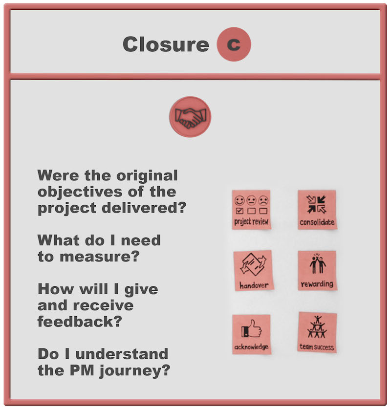

## Introduction to Project Management Framework

Project management is a sophisticated discipline that requires careful attention to multiple dimensions, phases, and methodologies. This guide explores the intricate details of project management, from initial conception through successful closure, incorporating both theoretical frameworks and practical applications.

## The Critical Initiation Phase

The initiation phase establishes the foundation for project success through careful consideration of fundamental elements.

### Essential Questions for Project Initiation
- Is this initiative truly a project?
- What specific problem requires solving?
- What are the exact needs and requirements?
- What options are available for achieving objectives?

### Core Elements of Project Initiation

1. **High-Level Planning**
   - Bird's eye view of project scope
   - Initial resource assessment
   - Preliminary timeline development

2. **SMART Target Setting**
   - **S**pecific: Clear, unambiguous objectives
   - **M**easurable: Quantifiable success criteria
   - **A**ligned: Consistent with organizational goals
   - **R**ealistic: Achievable with available resources
   - **T**ime-bound: Clear temporal boundaries

3. **Success Criteria Development**
   - Measurable outcomes
   - Quality standards
   - Performance metrics
   - Stakeholder satisfaction measures

4. **Authority and Resource Management**
   - Clear governance structure
   - Resource allocation framework
   - Decision-making protocols

## Comprehensive Planning Phase

The planning phase represents a critical junction where project success is largely determined through careful consideration of multiple elements.

### Three Key Planning Elements

1. **Scoping**
   - Detailed activity definition
   - Requirements analysis
   - Deliverable specification
   - Boundary setting

2. **Scheduling**
   - Timeline development
   - Resource allocation
   - Dependency mapping
   - Buffer integration

3. **Costing**
   - Budget development
   - Resource estimation
   - Contingency planning
   - Financial control mechanisms

### Work Breakdown Structure (WBS)

The WBS serves as a cornerstone of project planning, providing:

1. **Structural Elements**
   - Hierarchical task decomposition
   - Clear responsibility assignment
   - Deliverable mapping
   - Work package definition

2. **Integration Components**
   - Resource alignment
   - Schedule coordination
   - Cost allocation
   - Risk identification points

### Mission and Vision Integration

1. **Project Mission Statement**
   - Clear purpose definition
   - Stakeholder value proposition
   - Success criteria alignment
   - Organizational fit

2. **Vision Objectives**
   - Long-term goals
   - Strategic alignment
   - Value creation framework
   - Success indicators

## Schedule Development and Time Management

### The Five Steps of Schedule Development

1. **Activity Definition**
   - WBS alignment
   - Task specification
   - Scope verification
   - Deliverable mapping

2. **Activity Sequencing**
   - Dependency identification
   - Critical path analysis
   - Resource leveling
   - Buffer integration

3. **Resource Estimation**
   - Capacity analysis
   - Skill requirement mapping
   - Resource availability assessment
   - Allocation optimization

4. **Duration Estimation**
   - Work effort calculation
   - Resource efficiency consideration
   - Risk factor integration
   - Buffer allocation

5. **Schedule Development**
   - Timeline creation
   - Resource loading
   - Constraint integration
   - Stakeholder review

## Cost Management Framework

### Triple Constraint Management

1. **Quality Considerations**
   - Standards definition
   - Quality control processes
   - Verification methods
   - Acceptance criteria

2. **Cost Elements**
   - Direct costs
   - Indirect costs
   - Variable costs
   - Fixed costs

3. **Time Management**
   - Schedule control
   - Milestone tracking
   - Progress monitoring
   - Delay mitigation

### Cost Estimation Process

1. **Resource Identification**
   - Material requirements
   - Labor needs
   - Equipment specification
   - Support services

2. **Duration Calculation**
   - Activity timing
   - Resource utilization
   - Efficiency factors
   - Buffer requirements

3. **Cost Development**
   - Unit cost analysis
   - Total cost calculation
   - Contingency allocation
   - Budget baseline establishment

## Risk Management Framework

### PESTLE Analysis Framework

1. **Political Factors**
   - Government policies
   - Regulatory changes
   - Political stability
   - Public policy impact

2. **Economic Elements**
   - Market conditions
   - Financial factors
   - Resource availability
   - Economic stability

3. **Social Considerations**
   - Cultural impacts
   - Demographic factors
   - Social trends
   - Community effects

4. **Technological Aspects**
   - Technical requirements
   - Innovation impact
   - Technology availability
   - Technical risks

5. **Legal Requirements**
   - Regulatory compliance
   - Contractual obligations
   - Legal frameworks
   - Liability considerations

6. **Environmental Impacts**
   - Environmental regulations
   - Sustainability requirements
   - Climate considerations
   - Environmental risks

### Continuous Risk Management Process

1. **Risk Identification**
   - Systematic analysis
   - Scenario planning
   - Risk categorization
   - Impact assessment

2. **Risk Assessment**
   - Probability analysis
   - Impact evaluation
   - Risk prioritization
   - Response planning

3. **Risk Response Development**
   - Strategy selection
   - Resource allocation
   - Implementation planning
   - Monitoring framework

### Risk Response Strategies

1. **Risk Acceptance**
   - Impact analysis
   - Resource preparation
   - Contingency planning
   - Monitoring protocols

2. **Risk Transfer**
   - Contract management
   - Insurance coverage
   - Responsibility allocation
   - Legal protection

3. **Risk Avoidance**
   - Alternative approaches
   - Scope modification
   - Process redesign
   - Risk elimination

4. **Risk Mitigation**
   - Impact reduction
   - Probability minimization
   - Control implementation
   - Monitoring systems

## Project Closure Framework

### Closure Components

1. **Project Wrap-Up Process**
   - Deliverable verification
   - Documentation completion
   - Resource release
   - Administrative closure

2. **Success Evaluation**
   - Performance assessment
   - Objective achievement
   - Stakeholder satisfaction
   - Value delivery verification

3. **Lessons Learned**
   - Knowledge capture
   - Experience documentation
   - Best practice identification
   - Improvement recommendations

### Handover Process

1. **Documentation Requirements**
   - Technical specifications
   - User manuals
   - Maintenance procedures
   - Training materials

2. **Stakeholder Communication**
   - Final presentations
   - Benefit demonstration
   - Knowledge transfer
   - Transition planning

## Best Practices and Critical Success Factors

### Planning Excellence
- Thorough initial planning
- Regular plan updates
- Stakeholder engagement
- Resource optimization

### Risk Management
- Continuous assessment
- Proactive response
- Stakeholder communication
- Control implementation

### Quality Control
- Standard maintenance
- Performance monitoring
- Corrective action
- Continuous improvement

### Team Management
- Clear communication
- Role definition
- Performance support
- Development opportunities

## Conclusion: Keys to Project Success

Successful project management requires:
1. Comprehensive understanding of all phases
2. Careful attention to planning and execution
3. Continuous risk management
4. Effective stakeholder communication
5. Strong leadership and team management

The integration of these elements, combined with careful attention to detail and systematic approach to project phases, creates the foundation for consistent project success.

Remember: Project management is both an art and a science, requiring balance between structured methodology and flexible adaptation to changing conditions.