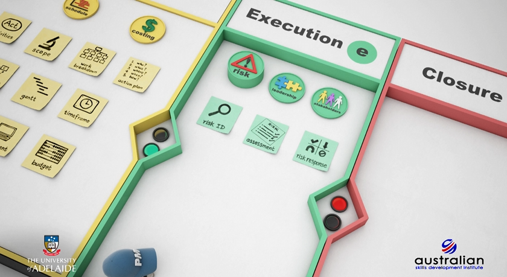

## Introduzione al Framework del Project Management

Il project management è una disciplina sofisticata che richiede un'attenta considerazione di molteplici dimensioni, fasi e metodologie. Questa guida completa esplora i dettagli intricati del project management, dalla concezione iniziale alla chiusura di successo, incorporando sia framework teorici che applicazioni pratiche.

## La Fase Critica di Avvio

La fase di avvio stabilisce le fondamenta per il successo del progetto attraverso un'attenta considerazione degli elementi fondamentali.

### Domande Essenziali per l'Avvio del Progetto
- Questa iniziativa è veramente un progetto?
- Quale problema deve essere risolto?
- Quali sono le esigenze e i requisiti esatti?
- Quali opzioni sono disponibili per raggiungere gli obiettivi?

### Elementi Fondamentali dell'Avvio del Progetto

1. **Pianificazione di Alto Livello**
   - Visione d'insieme dell'ambito del progetto
   - Valutazione iniziale delle risorse
   - Sviluppo preliminare della timeline

2. **Definizione degli Obiettivi SMART**
   - **S**pecifici: Obiettivi chiari e non ambigui
   - **M**isurabili: Criteri di successo quantificabili
   - **A**llineati: Coerenti con gli obiettivi organizzativi
   - **R**ealizzabili: Raggiungibili con le risorse disponibili
   - **T**emporalmente definiti: Limiti temporali chiari

3. **Sviluppo dei Criteri di Successo**
   - Risultati misurabili
   - Standard di qualità
   - Metriche di performance
   - Misure di soddisfazione degli stakeholder

4. **Gestione dell'Autorità e delle Risorse**
   - Struttura di governance chiara
   - Framework di allocazione delle risorse
   - Protocolli decisionali

## Fase di Pianificazione Completa

La fase di pianificazione rappresenta un punto critico dove il successo del progetto è largamente determinato attraverso un'attenta considerazione di molteplici elementi.

### Tre Elementi Chiave della Pianificazione

1. **Definizione dell'Ambito**
   - Definizione dettagliata delle attività
   - Analisi dei requisiti
   - Specificazione dei deliverable
   - Definizione dei confini

2. **Programmazione**
   - Sviluppo della timeline
   - Allocazione delle risorse
   - Mappatura delle dipendenze
   - Integrazione dei buffer

3. **Gestione dei Costi**
   - Sviluppo del budget
   - Stima delle risorse
   - Pianificazione delle contingenze
   - Meccanismi di controllo finanziario

### Work Breakdown Structure (WBS)

La WBS serve come pietra angolare della pianificazione del progetto, fornendo:

1. **Elementi Strutturali**
   - Decomposizione gerarchica dei task
   - Chiara assegnazione delle responsabilità
   - Mappatura dei deliverable
   - Definizione dei pacchetti di lavoro

2. **Componenti di Integrazione**
   - Allineamento delle risorse
   - Coordinamento della programmazione
   - Allocazione dei costi
   - Punti di identificazione dei rischi

### Integrazione di Missione e Visione

1. **Dichiarazione della Missione del Progetto**
   - Definizione chiara dello scopo
   - Proposta di valore per gli stakeholder
   - Allineamento dei criteri di successo
   - Adattamento organizzativo

2. **Obiettivi di Visione**
   - Obiettivi a lungo termine
   - Allineamento strategico
   - Framework di creazione del valore
   - Indicatori di successo

## Sviluppo della Programmazione e Gestione del Tempo

### Le Cinque Fasi dello Sviluppo della Programmazione

1. **Definizione delle Attività**
   - Allineamento con la WBS
   - Specificazione dei task
   - Verifica dell'ambito
   - Mappatura dei deliverable

2. **Sequenziamento delle Attività**
   - Identificazione delle dipendenze
   - Analisi del percorso critico
   - Livellamento delle risorse
   - Integrazione dei buffer

3. **Stima delle Risorse**
   - Analisi della capacità
   - Mappatura delle competenze richieste
   - Valutazione della disponibilità delle risorse
   - Ottimizzazione dell'allocazione

4. **Stima della Durata**
   - Calcolo dello sforzo lavorativo
   - Considerazione dell'efficienza delle risorse
   - Integrazione dei fattori di rischio
   - Allocazione dei buffer

5. **Sviluppo del Programma**
   - Creazione della timeline
   - Caricamento delle risorse
   - Integrazione dei vincoli
   - Revisione degli stakeholder

## Framework di Gestione dei Costi

### Gestione del Vincolo Triplo

1. **Considerazioni sulla Qualità**
   - Definizione degli standard
   - Processi di controllo qualità
   - Metodi di verifica
   - Criteri di accettazione

2. **Elementi di Costo**
   - Costi diretti
   - Costi indiretti
   - Costi variabili
   - Costi fissi

3. **Gestione del Tempo**
   - Controllo della programmazione
   - Tracciamento delle milestone
   - Monitoraggio dei progressi
   - Mitigazione dei ritardi

### Processo di Stima dei Costi

1. **Identificazione delle Risorse**
   - Requisiti materiali
   - Necessità di manodopera
   - Specifiche delle attrezzature
   - Servizi di supporto

2. **Calcolo della Durata**
   - Tempistica delle attività
   - Utilizzo delle risorse
   - Fattori di efficienza
   - Requisiti di buffer

3. **Sviluppo dei Costi**
   - Analisi dei costi unitari
   - Calcolo dei costi totali
   - Allocazione delle contingenze
   - Definizione della baseline di budget

## Framework di Gestione del Rischio

### Framework di Analisi PESTLE

1. **Fattori Politici**
   - Politiche governative
   - Cambiamenti normativi
   - Stabilità politica
   - Impatto delle politiche pubbliche

2. **Elementi Economici**
   - Condizioni di mercato
   - Fattori finanziari
   - Disponibilità di risorse
   - Stabilità economica

3. **Considerazioni Sociali**
   - Impatti culturali
   - Fattori demografici
   - Tendenze sociali
   - Effetti sulla comunità

4. **Aspetti Tecnologici**
   - Requisiti tecnici
   - Impatto dell'innovazione
   - Disponibilità tecnologica
   - Rischi tecnici

5. **Requisiti Legali**
   - Conformità normativa
   - Obblighi contrattuali
   - Framework legali
   - Considerazioni sulla responsabilità

6. **Impatti Ambientali**
   - Regolamenti ambientali
   - Requisiti di sostenibilità
   - Considerazioni climatiche
   - Rischi ambientali

### Processo di Gestione Continua del Rischio

1. **Identificazione dei Rischi**
   - Analisi sistematica
   - Pianificazione degli scenari
   - Categorizzazione dei rischi
   - Valutazione degli impatti

2. **Valutazione dei Rischi**
   - Analisi delle probabilità
   - Valutazione degli impatti
   - Prioritizzazione dei rischi
   - Pianificazione delle risposte

3. **Sviluppo delle Risposte ai Rischi**
   - Selezione delle strategie
   - Allocazione delle risorse
   - Pianificazione dell'implementazione
   - Framework di monitoraggio

### Strategie di Risposta ai Rischi

1. **Accettazione del Rischio**
   - Analisi degli impatti
   - Preparazione delle risorse
   - Pianificazione delle contingenze
   - Protocolli di monitoraggio

2. **Trasferimento del Rischio**
   - Gestione dei contratti
   - Copertura assicurativa
   - Allocazione delle responsabilità
   - Protezione legale

3. **Evitamento del Rischio**
   - Approcci alternativi
   - Modifiche dell'ambito
   - Riprogettazione dei processi
   - Eliminazione dei rischi

4. **Mitigazione del Rischio**
   - Riduzione degli impatti
   - Minimizzazione delle probabilità
   - Implementazione dei controlli
   - Sistemi di monitoraggio

## Framework di Chiusura del Progetto

### Componenti di Chiusura

1. **Processo di Conclusione del Progetto**
   - Verifica dei deliverable
   - Completamento della documentazione
   - Rilascio delle risorse
   - Chiusura amministrativa

2. **Valutazione del Successo**
   - Valutazione delle performance
   - Raggiungimento degli obiettivi
   - Soddisfazione degli stakeholder
   - Verifica della creazione di valore

3. **Lezioni Apprese**
   - Acquisizione della conoscenza
   - Documentazione dell'esperienza
   - Identificazione delle best practice
   - Raccomandazioni di miglioramento

### Processo di Consegna

1. **Requisiti di Documentazione**
   - Specifiche tecniche
   - Manuali utente
   - Procedure di manutenzione
   - Materiali di formazione

2. **Comunicazione con gli Stakeholder**
   - Presentazioni finali
   - Dimostrazione dei benefici
   - Trasferimento della conoscenza
   - Pianificazione della transizione

## Best Practice e Fattori Critici di Successo

### Eccellenza nella Pianificazione
- Pianificazione iniziale accurata
- Aggiornamenti regolari dei piani
- Coinvolgimento degli stakeholder
- Ottimizzazione delle risorse

### Gestione del Rischio
- Valutazione continua
- Risposta proattiva
- Comunicazione con gli stakeholder
- Implementazione dei controlli

### Controllo della Qualità
- Mantenimento degli standard
- Monitoraggio delle performance
- Azione correttiva
- Miglioramento continuo

### Gestione del Team
- Comunicazione chiara
- Definizione dei ruoli
- Supporto alle performance
- Opportunità di sviluppo

## Conclusione: Chiavi per il Successo del Progetto

Il successo nel project management richiede:
1. Comprensione completa di tutte le fasi
2. Attenzione accurata alla pianificazione ed esecuzione
3. Gestione continua del rischio
4. Comunicazione efficace con gli stakeholder
5. Leadership forte e gestione del team

L'integrazione di questi elementi, combinata con un'attenzione meticolosa ai dettagli e un approccio sistematico alle fasi del progetto, crea le fondamenta per un successo costante del progetto.

Ricorda: Il project management è sia un'arte che una scienza, richiedendo un equilibrio tra metodologia strutturata e adattamento flessibile alle condizioni mutevoli.
