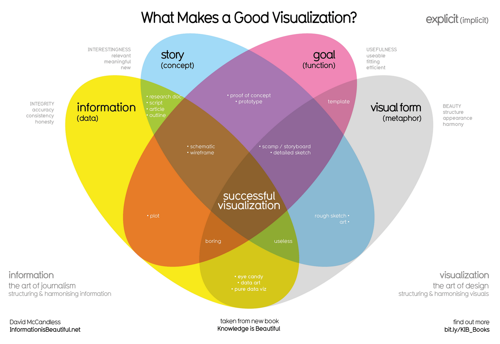
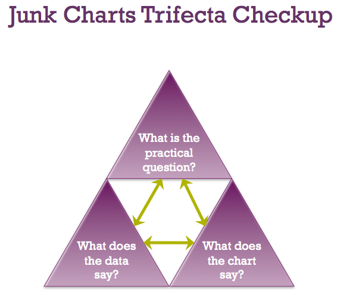
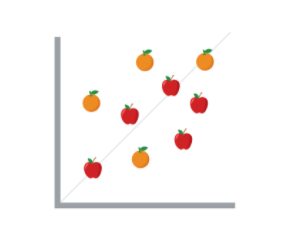

# Data Visualization Planning Notes

## Key Frameworks

### 1. McCandless Method

- Four critical elements:
  - Information: Raw data foundation
  - Story: Compelling narrative structure
  - Goal: Specific visualization objective
  - Visual form: Effective metaphor/expression
- All elements must be present for effectiveness
- Missing elements lead to incomplete communication

### 2. Kaiser Fung's Junk Charts Trifecta

- Three core evaluation questions:
  - What's the 4ractical question?
  - What does the data reveal?
  - What does the visual communicate?
- Focuses on audience perspective
- Ensures alignment between intent and execution

## Pre-attentive Attributes

### Marks (Basic Visual Elements)
1. Position  

   - Relative placement in space
   - Comparative relationship between elements
   - Scale considerations

1. Size  

   - Dimensional relationships
   - Scale importance
   - Careful attention to unintended comparisons

2. Shape  

   - Object representation
   - Intuitive visual metaphors
   - Enhanced interpretation speed

3. Color  

   - Group differentiation
   - Status representation
   - Category distinction

### Channels (Data Characteristic Visualization)
1. Accuracy  

   - Estimation precision
   - Categorical vs quantitative representation
   - Value clarity

2. Popout  

   - Visual distinction methods
   - Attention direction
   - Pre-attentive attribute utilization

3. Grouping  

   - Proximity considerations
   - Similarity relationships
   - Visual connectivity

## Best Practices
- Balance information density vs clarity
- Emphasize selectively (multiple emphasis reduces impact)
- Ensure visual accuracy
- Consider audience interpretation
- Maintain consistent scale
- Leverage pre-attentive processing