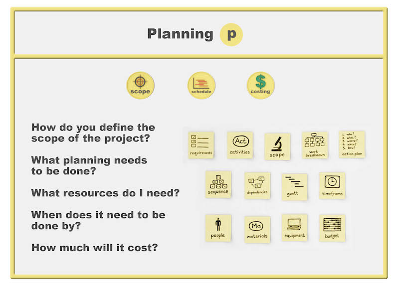

## Course content:
- Week 1: Project management basics, life cycle phases, and management dimensions
- Week 2: Project management canvas and initiation phase
- Week 3: Project planning - scope, schedule, and cost
- Week 4: Risk identification and mitigation
- Week 5: Leadership, communication, and stakeholder engagement
- Week 6: Project closure and deliverables

## 🎯 Initiation Phase:

**Main Purpose**:
- Determine exact project needs
- Consider various options for outcomes
### Essential Questions:
- Is this a project?
- What problem needs solving?
- What's needed?
- What are available options?

### Process Steps:
- Create high-level plan (bird's eye view)
- Set SMART targets:
       - **S**pecific
       - **M**easurable
       - **A**ligned
       - **R**ealistic
       - **T**ime bound
### Important Elements 🔍:
- Develop success criteria
- Establish clear scope
- Balance time, cost, quality
- Ensure proper authority for resource management

    Key Requirement ⚡: Must have clear understanding before moving to next phase

## Planning Phase

The project planning phase consists of three key elements:
1. **Scoping**: Determining and agreeing on activities needed to meet project requirements
2. **Scheduling**: Placing activities into a time frame for completion
3. **Costing**: Estimating resources and budget needed to complete project within schedule
### Critical Questions
- How to define project scope? 
- What planning is needed? 
- Required resources? 
- Timeline requirements? 
- Cost estimation? 
### Important Note
> Failing to plan means planning to fail

 - Requires diligence
 - Time investment
 - Thorough information gathering
 - Detailed planning to avoid mishaps

These elements require diligent planning and information gathering to prevent potential issues. The phase addresses critical questions about project definition, resource requirements, timeline, and budget constraints.

### Project Plan Documentation

A comprehensive project plan serves as a critical reference document that must be executable and well-documented. It should detail:

#### Mission and Vision Elements
- Project mission statement
- Vision objectives
- Clear execution pathways

#### Work Breakdown Structure (WBS)

The scope is decomposed into workable elements through WBS:
- Tasks broken into executable chunks
- Each element properly resourced
- Time-phased scheduling integration
- Ensures work units can be completed effectively
#### Resource Management
Successful resource allocation requires:
- Matching right people to right tasks
- Setting up team members for success
- Clear task scoping for resource readiness
- Proper allocation timing
#### Comprehensive Planning Components
The project management plan must include:
- Detailed execution processes
- Applied procedures
- Schedule management
- Budget allocation
- Resource distribution
- Monitoring mechanisms
- Control procedures
#### Key Success Factors
Project planning maturity involves:
- Intellectual skill application
- Personal skill utilization
- Working skill integration
- Detailed execution articulation
- Clear stakeholder communication
 
#### Monitoring Framework
- Feedback mechanisms
- Progress tracking systems
- Control procedures
- Performance measurements
 
*Note: The emphasis is on creating an actionable, documented plan rather than just theoretical planning. Poor documentation or non-executable plans often lead to project failures.*

## Scoping the Project
### Key Elements for Scope Definition 
1. Clear Project Objectives 
    - Builds on objectives established during initiation 
    - Requires formal clarification before scope planning 
    - Must be broken down into manageable components 
1. Task Identification
    - Determining specific activities needed 
    - Mapping required resources
    - Setting clear project parameters 
2. Scope Boundaries
    - "In Scope" vs "Out of Scope" elements
    - Clear identification of excluded aspects 
    - Prevention of scope creep and additional functionality
### Core Principles 
- Represents complete project scope
- Organizes all deliverables systematically
- Acts as project scope control tool
- Forms basis for project scheduling
- Will be refined after risk assessment
### Development Process 
1. Start with identifying project deliverables 
2. Subdivide work into manageable components 
3. Break major tasks into specific sub-tasks 
4. Ensure clear definition of each step 
5. Create hierarchical structure of activities
### Critical Considerations
- If not in WBS, it should not be executed 
- Smaller, clearly defined steps increase success probability 
- Acts as foundation for schedule development 
- Requires regular review and refinement 
- Must align with original project objectives 
## Planning Phase Best Practices 

1. Thorough Objective Analysis 
    - Review and understand initial project goals 
    -  Break down broad objectives into specific components 
    - Ensure alignment with stakeholder expectations 
2. Scope Control 
    - Clear definition of included/excluded elements
    - Early identification of potential scope creep
    - Regular scope review and validation 
3. Resource Integration
    - Early identification of required resources 
    - Clear allocation planning 
    - Consideration of resource constraints
4. Documentation
    - Detailed recording of all scope decisions 
    - Clear communication of scope boundaries 
    - Regular updates as project evolves

## Project Scheduling and Time Management

### Triple Constraints of Project Management
Project management balances three key constraints:
1. Quality
2. Cost 
3. Time (least flexible)

These constraints are interconnected - changing one impacts the others. Time management requires special attention as it's typically the most rigid constraint.

### The Five Steps of Schedule Development

#### 1. Activity Definition
The process begins by defining specific tasks needed to produce project deliverables. Each activity must align with the Work Breakdown Structure (WBS). This alignment serves as a validation check - if an activity doesn't match the WBS, either:
- The activity is unnecessary
- The WBS needs updating

#### 2. Activity Sequencing 
This step involves mapping the process flow of tasks. A project manager must:
- Determine the logical order of activities
- Identify dependencies between tasks
- Understand which activities can run parallel
- Recognize which tasks must wait for others to complete

#### 3. Resource Estimation
Resource estimation covers all elements needed for task completion:
- Required materials
- Necessary equipment
- Personnel requirements
- Support resources

#### 4. Duration Estimation
Duration estimation considers:
- Work effort required
- Available resources
- Resource efficiency
- Potential constraints
- Buffer time needs

Note: Duration and resource estimation are deeply interconnected - changes in one often affect the other.

#### 5. Schedule Development
The final step integrates all previous elements into a working schedule. This involves:
- Combining all requirements
- Creating an initial draft
- Multiple refinements
- Stakeholder review
- Continuous monitoring and updates

### Best Practices for Schedule Management

#### Iterative Refinement
- Initial schedules should be considered drafts
- Multiple revisions are normal and expected
- Refinement should continue until implementation begins

#### Monitoring and Control
- Regular schedule reviews during project execution
- Adaptation to changing circumstances
- Continuous assessment of progress
- Proactive adjustment when needed

#### Example Application: Janet's DIY Project
For a home improvement tiling project spanning four weekends:
1. Define specific tiling activities
2. Sequence preparation, execution, and finishing tasks
3. List required tools and materials
4. Estimate time for each task within the four-weekend constraint
5. Create detailed weekend-by-weekend schedule

The scheduling process benefits from using templates to systematically capture:
- Task descriptions
- Required resources
- Expected durations
- Dependencies
- Completion criteria

## Project Cost Management and Budgeting

### Understanding Cost as a Triple Constraint

Cost forms one of the three fundamental constraints in project management, alongside time and quality. Think of these three elements as interconnected legs of a stool - if you adjust one, it affects the stability of the others. When we work with a fixed budget, it acts as a boundary that shapes all other project decisions.

### The Cost Estimation Process

The process of developing a cost estimate follows a logical sequence, much like building a house - you need a strong foundation before adding the walls and roof. Here's how it works:

First, we identify resource requirements. This means listing everything needed to complete each project activity:
- Physical materials (like Janet's tiles and cement)
- Equipment (such as the tile cutter)
- Human resources (potential helpers like Ben)
- Supplies and additional materials

Next, we calculate duration estimates for each resource. This step connects our cost planning directly to our schedule planning. For example:
- How many days we'll need to rent equipment
- How many hours of labor we'll require
- How long we'll need specific materials or supplies

Finally, we develop the actual cost estimate using current market prices and available information. This is where experience with similar projects becomes invaluable - it helps us make more accurate predictions.

### Managing Scope Changes and Budget Constraints

When unexpected costs or scope changes arise (as they often do), we face an important decision-making process. Think of it like trying to fit more items into a packed suitcase - something has to give. We have two main options:

1. Seek Additional Funding:
  - Present a detailed cost impact analysis
  - Justify why the additional scope is necessary
  - Request budget increase based on specific needs

2. De-scope the Project:
  - Reduce existing scope to accommodate new requirements
  - Make strategic compromises while maintaining core objectives
  - Accept potential quality impact

This is why careful initial planning is so crucial - it helps minimize these difficult choices later. The more thoroughly we plan at the beginning, the less likely we are to face major budgetary challenges during execution.

### Cost Control Best Practices

Successful cost management requires ongoing vigilance and control. Consider these strategies:
- Regular budget reviews
- Careful documentation of all expenses
- Proactive identification of potential cost overruns
- Clear communication with stakeholders about budget status
- Maintaining a contingency reserve for unexpected costs

By understanding these fundamentals of cost management, project managers can better navigate the challenges of delivering projects within budget constraints while maintaining quality standards.

## Execution Phase

## Project Risk Management Study Notes

### Core Concept
Risk represents uncertainty in projects - events that may or may not occur but could impact project deliverables and objectives. Understanding that complete certainty is impossible in project planning is fundamental to risk management.

### Factors Influencing Project Risk Levels
Projects face varying degrees of risk based on several key factors:
1. Project scope and duration
2. Time gap between planning and execution phases
3. Team's experience level with similar projects
4. Technology maturity being utilized

### Risk Management Process
Risk management consists of three main components:
1. Identification of potential risks
2. Assessment of identified risks
3. Development of response strategies

### Ongoing Nature of Risk Management
Risk management is not a one-time activity but rather:
- Continues throughout the execution phase
- Requires constant monitoring and review
- Demands regular assessment and updates
- Necessitates continuous communication

### Critical Success Elements
For effective risk management implementation:
- Regular team communication must be maintained
- Stakeholder engagement is essential
- Early preparation and planning helps reduce or eliminate risks
- Proactive identification and assessment of risks is crucial

### Key Strategic Question
When approaching risk management, always consider:
"What risks do I need to consider on this project?"
This guides the identification and assessment process for project-specific risks.

### Application Note
While risk cannot be completely eliminated, proper risk management makes projects run more smoothly by providing structure and preparedness for potential uncertainties.

## The Critical Role of Risk Planning in Project Success

### Understanding Project Failure
Project failure is a common occurrence that spans across all project scales, from small DIY endeavors to large complex construction initiatives. A key contributor to these failures is inadequate risk management and planning.

### The Cost of Rushed Risk Management 
Project managers often make the critical mistake of rushing through risk identification and management processes. This haste in the early stages can lead to severe consequences later in the project lifecycle, potentially resulting in complete project failure.

### Components of Effective Risk Assessment
The foundation of successful risk management lies in two main components:
1. Evaluating the likelihood of identified risks
2. Assessing the potential impact of these risks

When these components are carefully analyzed, project managers gain a comprehensive understanding of their project landscape, enabling more effective planning and risk mitigation strategies.

### The Time Investment Principle
While dedicating additional time to risk identification and management strategy development may seem burdensome initially, it proves invaluable in the long run. This upfront investment in thorough risk planning typically results in:
- Smoother project execution
- Fewer unexpected challenges
- More controlled project outcomes
- Better resource management

### Strategic Implementation
The process requires:
- Careful consideration of all potential risks
- Development of comprehensive management strategies
- Integration of risk planning into the broader project framework
- Regular review and updating of risk assessments

This systematic approach to risk management transforms potential project chaos into structured, manageable progress.

## Comprehensive Approach to Project Risk Identification and Management

### Categories of Project Risk
Project risks manifest in several distinct forms, each requiring unique consideration and management approaches:

The tangible risks can be quantified and measured directly:
- Technical risks affecting project execution and delivery
- Financial risks impacting budgets and resources
- Commercial risks involving business relationships and contracts
- Schedule risks leading to delayed deliveries and missed deadlines

The intangible risks are harder to measure but equally important:
- Reputational risks that could damage brand value
- Relationship risks affecting stakeholder trust
- Long-term organizational impacts

### Systematic Risk Identification Method
A comprehensive approach to identifying risks involves walking through the project lifecycle systematically. This process includes:

First, gather essential project documentation:
- Work breakdown structure (WBS)
- Project schedule
- Milestone deadlines
- Resource allocations

Then, conduct a thorough analysis by:
1. Examining each work package chronologically
2. Considering the project's maturity at each stage
3. Evaluating contextual factors and dependencies
4. Asking the critical question: "What could go wrong here?"

### Risk Assessment and Treatment Strategy
When evaluating identified risks, project managers must develop appropriate treatment strategies through careful analysis:

Low-Impact Risks:
- Assess probability of occurrence
- Evaluate potential consequences
- Make informed decisions about acceptable risk levels

High-Impact Risks:
- Identify potential catastrophic impacts on schedule
- Evaluate financial implications
- Consider reputational consequences
- Develop detailed mitigation strategies

### Collaborative Risk Management
Effective risk management requires a team-based approach:

Project Team Involvement:
- Team members often have the most direct experience with specific work areas
- Their hands-on knowledge provides valuable insights into potential risks
- They may identify risks that might be overlooked by management

Stakeholder Engagement:
- Regular communication with stakeholders
- Integration of diverse perspectives
- Comprehensive risk assessment through multiple viewpoints

This collaborative approach ensures a more thorough and effective risk management process, leading to better project outcomes through shared responsibility and diverse expertise.

## The Six-Step Risk Management Framework: From Planning to Communication

### Understanding the Foundation of Risk Management
Risk management forms the cornerstone of successful project delivery, specifically because it deals with future uncertainties. The time invested in risk planning directly correlates with the effectiveness of risk monitoring and control during project execution. This systematic approach applies to projects of all sizes and complexities, as hoping to avoid risks is never an adequate strategy.

### The International Standard Risk Management Process
The globally recognized risk management framework consists of six interconnected steps that create a comprehensive approach to managing project risks:

#### Step 1: Context Analysis and Objective Confirmation
The process begins with a thorough understanding of the project's context and a clear confirmation of project objectives. This foundational step ensures all risk management activities align with what the project aims to achieve. Project managers must clearly define success criteria and deliverables before proceeding with risk identification.

#### Step 2: Risk Identification
This crucial step involves identifying all potential risks that could impact project objectives. Success in this phase relies heavily on collaborative effort, bringing together:
- Project team members with direct operational knowledge
- Experienced stakeholders who can provide valuable insights
- Subject matter experts who understand technical challenges
The goal is to create a comprehensive list of potential risks across all project areas.

#### Step 3: Risk Assessment and Prioritization

Risk assessment involves evaluating each identified risk using two key metrics:
- Likelihood: The probability of the risk occurring
- Impact: The potential consequences if the risk materializes
Special attention must be given to risks that, despite low probability, could have catastrophic impacts. This assessment helps in prioritizing risks and allocating appropriate resources for their management.

#### Step 4: Response Strategy Development
Projects can respond to risks in four distinct ways:
1. Risk Acceptance: Acknowledging and preparing for potential consequences
2. Risk Transfer: Shifting responsibility to other parties (contractors, clients)
3. Risk Mitigation: Implementing measures to reduce probability or impact
4. Risk Avoidance: Changing plans to eliminate the risk entirely

The chosen strategy should align with the risk's priority level and potential impact on project objectives.

#### Step 5: Continuous Monitoring and Review
This ongoing process involves:
- Tracking identified risks for occurrence
- Reassessing likelihood and impact ratings
- Identifying new risks as they emerge
- Evaluating the effectiveness of existing risk responses
This step emphasizes that risk management is a dynamic, continuous process rather than a one-time activity.

#### Step 6: Stakeholder Communication
The final step focuses on effective communication of risk management outcomes to stakeholders, enabling informed decision-making and maintaining transparency throughout the project lifecycle.

### Practical Application: The Wedding Planning Example
To illustrate this framework, consider a wedding planning project where:

#### Risk Types and Responses
- Predictable Risks: Weather conditions requiring backup venues
- Unpredictable Risks: Personal factors affecting key participants
- Procurement Risks: Managing multiple vendors and suppliers

#### Risk Management Strategies
1. Building Time Buffers: Setting earlier deadlines for crucial deliverables
2. Creating Contingency Plans: Developing backup options for critical elements
3. Managing Dependencies: Understanding and planning for knock-on effects
4. Supplier Management: Implementing early delivery requirements for critical items

### Key Takeaways for Implementation
1. Invest adequate time in comprehensive risk identification
2. Consider both controllable and uncontrollable risks
3. Evaluate risks based on both likelihood and potential impact
4. Develop specific strategies for each significant risk
5. Maintain continuous monitoring and adjustment of risk responses
6. Ensure clear communication with all stakeholders throughout the process

## PESTLE Framework: A Systematic Approach to Project Risk Assessment
### Understanding Risk Assessment Fundamentals
Risk management requires continuous attention throughout a project's lifecycle. A critical understanding in risk assessment is that even unlikely events can have catastrophic impacts if they occur. This principle underscores the importance of evaluating both the likelihood and potential impact of each risk when determining its significance to the project.

### The PESTLE Risk Assessment Framework

PESTLE, traditionally used in marketing and organizational strategy, provides an excellent structure for comprehensive project risk identification. This framework helps project managers systematically consider risks across six key dimensions:

**Political Risks**:
These involve governmental policies, leadership changes, or regulatory shifts that could affect the project. In construction, this might include changes in building codes or zoning regulations.

**Economic Risks**:
These encompass financial factors such as interest rates, market conditions, or economic downturns that could impact project viability. For home construction, this could include fluctuations in material costs or mortgage rates.

**Social Risks**:
These relate to cultural trends, demographic changes, or community reactions that might influence the project. In home building, this could include changing consumer preferences or neighborhood opposition to development.

**Technological Risks**:
These involve technical challenges, technological changes, or innovation-related uncertainties. For construction projects, this might include new building technologies or software system implementations.

**Legal Risks**:
These encompass regulatory compliance, contractual obligations, and potential legal challenges. Home builders must consider permits, warranties, and liability issues.

**Environmental Risks**:
These relate to ecological impacts, weather conditions, or environmental regulations. Construction projects must consider factors like soil conditions, weather patterns, and environmental protection requirements.

### Implementation in Project Planning
When applying the PESTLE framework to project risk assessment:

1. Rating Scale Application:
  - Each category is evaluated on a scale of 1 (low risk) to 5 (very high risk)
  - Ratings should reflect both likelihood and potential impact
  - The maximum total score possible is 30 points

2. Risk Profile Development:
  - Scores are aggregated across all categories
  - The total score provides an indicative risk level for the project
  - This assessment helps inform risk management strategies

3. Practical Usage:
  - Assessment should be completed during the planning phase
  - Results guide resource allocation and contingency planning
  - The framework provides a structured approach to risk identification

### Real-World Application: Home Construction Example
In the context of home construction, project managers must evaluate:
- Political aspects like local building regulations and zoning laws
- Economic factors such as material costs and labor availability
- Social considerations including neighborhood impact and market demand
- Technological requirements for modern building methods
- Legal compliance with construction codes and contracts
- Environmental factors including weather conditions and site characteristics

This comprehensive evaluation creates a foundation for effective risk management planning, allowing project managers to develop targeted strategies for identified risks. The systematic nature of the PESTLE framework ensures that no major risk category is overlooked in the planning process.

## Risk Response Strategies in Project Management: A Comprehensive Framework

### Understanding Risk Response Development
When developing risk responses, project managers should carefully evaluate multiple options rather than immediately implementing mitigation strategies for every identified risk. This thoughtful approach ensures resources are allocated effectively and responses are proportional to the risk level. The development of response strategies should be integrated into the broader project management framework, considering both immediate and long-term implications.

### The Four Fundamental Risk Response Strategies

#### 1. Risk Acceptance
This strategy involves acknowledging and preparing for potential risk impacts. Project managers choose this approach when:
- The risk impact is manageable within project constraints
- The cost of other response strategies outweighs potential benefits
- Team capabilities align with risk management requirements

For example, in Janet's case, she accepted the technical risk of laying tiles herself, compensating for her lack of experience through thorough research and preparation.

#### 2. Risk Transfer
This approach involves shifting risk responsibility to other parties better equipped to manage it. Project managers implement this strategy when:
- Other stakeholders possess specialized expertise
- The organization has access to capable resources
- Risk management requires specific skills outside the core team

Peter's case illustrates this effectively - he transferred stakeholder management risks to colleagues with specific expertise in this area, leveraging organizational resources to enhance project outcomes.

#### 3. Risk Avoidance
Sometimes, the most appropriate response is to eliminate the risk entirely by changing project parameters or canceling high-risk components. This strategy is appropriate when:
- Risk levels exceed acceptable thresholds
- Potential negative impacts outweigh project benefits
- Alternative approaches can achieve similar objectives with lower risk

#### 4. Risk Mitigation
This involves reducing either the probability of risk occurrence or its potential impact. For instance, Janet's early engagement with tile suppliers demonstrates effective mitigation by:
- Establishing early supplier relationships
- Confirming product availability
- Creating buffer time for potential delays

### Implementing Risk Response Strategies

#### The Process Framework
Risk response implementation requires:
1. Systematic risk assessment and categorization
2. Evaluation of response options considering project context
3. Selection of appropriate strategies based on risk severity
4. Regular monitoring and strategy adjustment

#### Continuous Management Approach
Risk management must be viewed as an ongoing process rather than a one-time activity. This involves:
- Regular review of identified risks
- Assessment of response strategy effectiveness
- Adjustment of strategies as project conditions change
- Identification and evaluation of new risks

### Universal Application Principles
The risk management process should be:
- Applied early in the project lifecycle
- Implemented regardless of project size or type
- Flexible enough to accommodate changing conditions
- Integrated into overall project management methodology

### Practical Implementation Considerations
For successful risk response implementation, project managers should:
- Seek formal recognition of project risks within the organization
- Engage key stakeholders in risk response planning
- Maintain clear communication channels for risk updates
- Document risk response strategies and their outcomes
- Regular review and update of risk response effectiveness

This comprehensive approach to risk response ensures that project managers can effectively handle uncertainties while maintaining focus on project objectives and deliverables.

## The Three Core Activities of Continuous Risk Management

### Understanding the Continuous Nature of Risk
Project risks are not static events but dynamic challenges that evolve throughout a project's lifecycle. Risk management must therefore be approached as a continuous, ongoing process rather than a one-time assessment. This understanding forms the foundation for implementing the three key risk management activities effectively.

### First Core Activity: Risk Identification
The risk identification process begins with thorough scenario analysis, asking "what if" questions to uncover potential challenges. This systematic approach helps project managers anticipate problems before they materialize. 

When conducting risk identification, project managers should consider both internal and external risk categories:

Economic factors might include market fluctuations, resource costs, or funding availability. Each economic risk can create ripple effects throughout the project, potentially triggering additional risks in other areas.

Organizational considerations encompass team capabilities, resource allocation, and internal processes. These risks often interconnect with other categories, as organizational challenges can impact technical implementation and project timelines.

Political elements could involve regulatory changes, policy shifts, or stakeholder relationships. Political risks frequently overlap with legal and environmental categories, creating complex risk scenarios that require careful consideration.

Technological aspects include both current capabilities and potential innovations. These risks can significantly impact project deliverables and often interface with organizational and economic risks.

Environmental factors comprise both natural and built environment considerations. These risks can affect project timelines, resource availability, and implementation strategies.

Legal requirements encompass compliance, contractual obligations, and regulatory frameworks. Legal risks often intersect with political and environmental categories, requiring comprehensive risk management strategies.

### Second Core Activity: Risk Assessment
Risk assessment involves evaluating two critical dimensions of each identified risk:

The likelihood dimension examines the probability of risk occurrence. This assessment requires careful analysis of historical data, current conditions, and future projections to estimate how likely each risk is to materialize.

The consequence dimension evaluates potential impacts if risks do occur. This analysis must consider both immediate effects and long-term implications for project success.

Through this dual analysis, project managers can develop a comprehensive understanding of risk factors and identify necessary actions for risk mitigation. The assessment process helps prioritize risks and allocate resources effectively for risk management.

### Third Core Activity: Risk Response
Risk response strategies must be tailored to the specific characteristics of each identified and assessed risk. The process involves selecting the most appropriate response from several options:

Risk avoidance represents the ideal scenario, eliminating risk entirely. However, this option isn't always feasible given the inherent uncertainty in project environments. Project managers must carefully evaluate when avoidance is possible and when other strategies are more appropriate.

Risk reduction focuses on limiting either the likelihood or the severity of risk impacts. This strategy often involves implementing specific controls, procedures, or safeguards to manage risk exposure.

Risk acceptance becomes appropriate when the cost of managing a risk is lower than the potential impact. This strategy requires careful cost-benefit analysis and clear documentation of acceptance criteria.

Risk transfer involves shifting risk responsibility to another party better equipped to manage it. This strategy requires careful consideration of contractual arrangements and stakeholder relationships.

### Integration of Risk Management Activities
The effectiveness of risk management depends on how well these three core activities work together. Each activity builds upon the others, creating a comprehensive risk management framework:
- Risk identification provides the foundation for assessment
- Assessment informs response strategy selection
- Response implementation leads to ongoing monitoring
- Monitoring may identify new risks, beginning the cycle anew

This integrated approach ensures that project managers can effectively navigate uncertainties while maintaining focus on project objectives and deliverables. The continuous nature of these activities helps projects adapt to changing conditions and maintain effective risk management throughout the project lifecycle.

## Project Closure: The Critical Final Phase of Project Management

### Understanding Project Closure's Fundamental Purpose

Project closure serves as the culminating phase of the project lifecycle, where all the planning, execution, and monitoring efforts come together for final evaluation and handover. Think of it as the careful process of wrapping up a valuable package – every detail matters and needs to be properly secured before delivery.

### Essential Components of Effective Project Closure

The closure phase consists of three interconnected components that work together to ensure a successful project conclusion:

The Project Wrap-Up Process encompasses all the technical and administrative tasks needed to formally close the project. Imagine this as clearing your desk at the end of a long workday – everything needs to be in its proper place. This includes:

First, obtaining formal project acceptance from stakeholders. The project manager must demonstrate that all deliverables meet the agreed-upon specifications and quality standards. This is similar to a final inspection before accepting delivery of a new home.

Second, finalizing all resource-related matters. This involves closing financial accounts, reassigning team members, and properly disposing of or reallocating project materials and equipment. Think of this as closing all the open tabs in your browser – nothing should be left hanging.

Third, compiling and submitting the final project report. This comprehensive document serves as the official record of the project's journey from initiation to completion.

### Project Success Evaluation: Beyond Simple Metrics

Success evaluation requires looking at the project through multiple lenses:

The Traditional Metrics approach examines the classic project management triangle of time, cost, and quality. Consider these questions:
- Did we deliver within the original timeframe?
- Did we stay within the allocated budget?
- Do the deliverables meet quality specifications?

The Stakeholder Satisfaction dimension explores the human side of project success:
- Are stakeholders satisfied with the outcomes?
- Was communication effective throughout the project?
- Did the team work cohesively toward project goals?

### The Critical Role of Lessons Learned

The lessons learned process serves as a bridge between current and future project success. Think of it as creating a treasure map for future project managers. Here's why it matters:

Knowledge Capture is essential but often challenging. Many organizations struggle with this aspect due to:
- Time pressures pushing teams to move quickly to new projects
- Reluctance to discuss challenges or failures
- Lack of structured processes for capturing insights

Effective Implementation requires:
- Creating a blame-free environment for honest discussion
- Developing systematic approaches to capturing insights
- Establishing mechanisms for sharing knowledge across projects
- Building a culture that values continuous improvement

### Measuring Project Progress and Success

Project managers must develop robust systems for measuring success throughout the project lifecycle. This involves:

Creating a Baseline Plan that serves as your project's roadmap. This plan should include:
- Detailed cost estimates
- Timeline projections
- Clear performance metrics
- Quality standards

Implementing Regular Monitoring through:
- Earned value management systems
- Progress tracking against baseline
- Regular stakeholder updates
- Performance reviews

### The Art of Project Handover

The handover process requires careful attention to detail and clear communication. Consider these key elements:

Documentation Requirements:
- Technical specifications
- User manuals
- Warranties and guarantees
- Maintenance procedures
- Training materials

Stakeholder Communication:
- Final presentations to key stakeholders
- Demonstration of project benefits
- Clear transition plans
- Knowledge transfer sessions

### Celebrating Success

Project closure should include a celebration of achievements. This final step:
- Recognizes team contributions
- Builds organizational morale
- Strengthens team relationships
- Creates positive memories for future collaboration

### Moving Forward

The closure phase provides valuable opportunities for professional growth and organizational learning. By carefully documenting successes, challenges, and lessons learned, project managers create a foundation for continuous improvement in project management practices.
